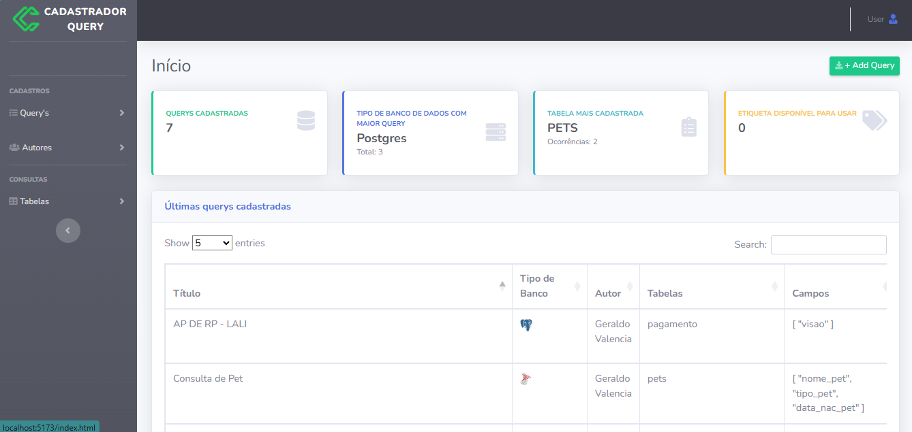
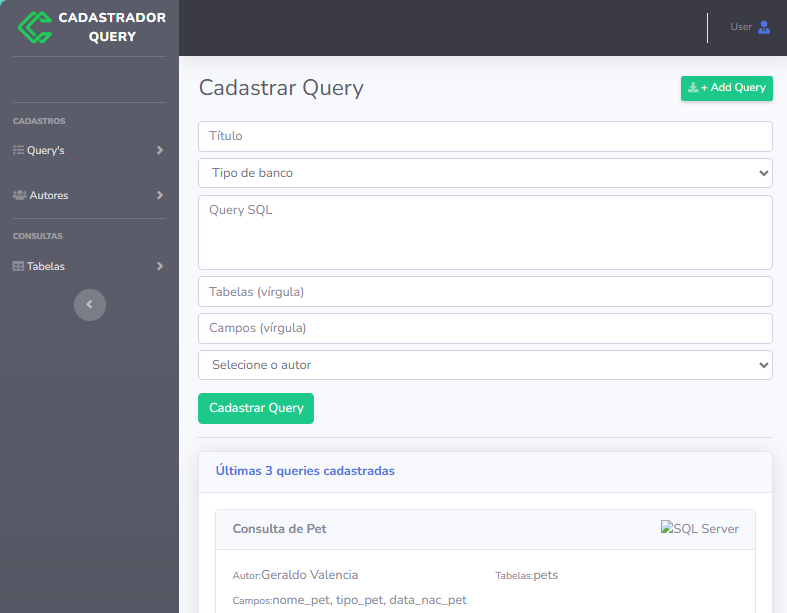
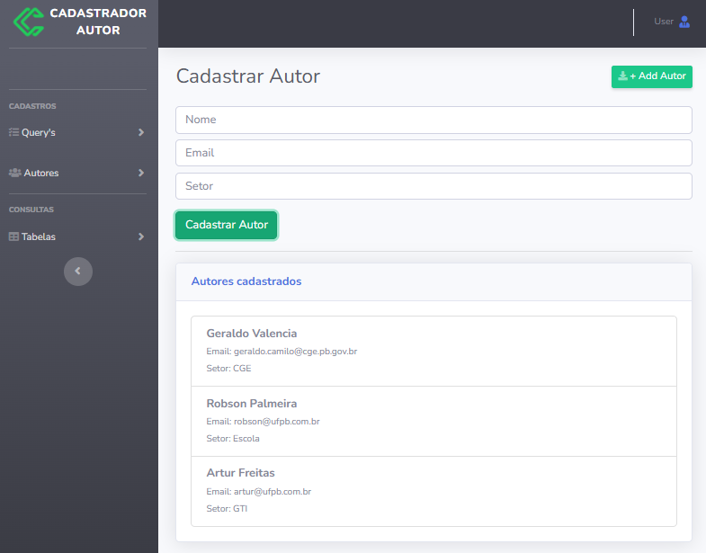

# cadastrador-query
 Aplicação criada para fazer jus a tarefa do curso full stack - UNIPE.

 Diagrama de Projeto: FIGMA

- ## **Nome do projeto**
 Cadastrador-Querys

- ## **Nome da Equipe**
 **Robson Palmeira, **
 **Geraldo Valencia, **
 **Artur Freitas**
 
- ## **Objetivo da aplicação**
  O Objetivo da aplicação é cadastrar querys utilizadas no dia a dia de forma a armazenar todo o conteúdo em um único repositório, evitando assim guardá-los em pastas, o que dificulta a localização. Existirá tags que ajudem a localizar as querys por tema e outros detalhes.

- ## **Funcionalidades principais (mínimo viável)**
  Logar
  Pesquisar, Incluir, Alterar e desativar visualização de querys.
  Pesquisar por palavra-chave, Tipo de banco, tabelas, Tags, data de  criação ou alteração, campos da query.

- ## **Divisão de camadas (front, back, dados – mesmo que o foco agora seja só front)**
  Front.....: Vue com Bootstrap
  Back-End..: Node
  Banco.....: mongoDb 
 
- ## Telas do Sistema

### Tela de Cadastro de Query

### Tela Inicial com Dashboard

### Tela de Cadastro de Autor

- ## **Campos de formulário (se houver)**
- ## **Interações esperadas (ex: clicar, buscar, enviar, exibir...)**

  OBS: Vamos dar continuidade neste projeto no próximo encontro!
